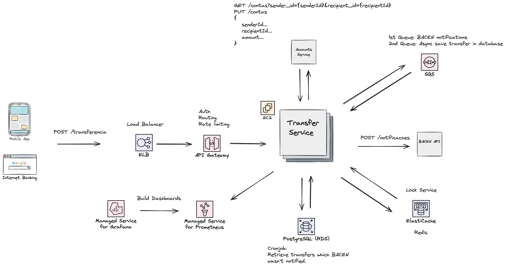
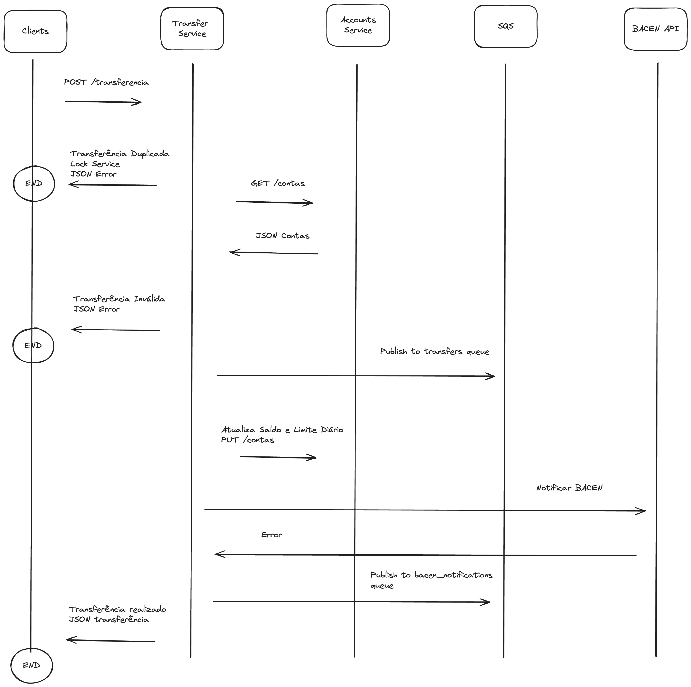

# Challenge Itaú

## Deploy Local

### Requisitos

- Docker
- Docker Compose
- Git
- API Client de sua preferência, por exemplo, [Postman](https://www.postman.com/).

### Passo a passo
1. Clonar o repositório
```shell
git clone git@github.com:Farabolini/challenge-itau.git
```
2. Iniciar os containers
```shell
docker-compose -f challenge-itau-compose.yml up -d
```
3. Aguardar a inicialização, possível verificar o status usando o seguinte comando:
```shell
docker-compose -f challenge-itau-compose.yml ps

NAME                        IMAGE                     COMMAND                                                                        SERVICE    CREATED          STATUS                    PORTS
challenge-itau-app-1        challenge-itau:latest     "java -jar app/challenge-itau.jar"                                             app        13 seconds ago   Up 1 second               0.0.0.0:8080->8080/tcp
challenge-itau-db-1         postgres:alpine           "docker-entrypoint.sh postgres"                                                db         13 seconds ago   Up 12 seconds (healthy)   0.0.0.0:5432->5432/tcp
challenge-itau-redis-1      bitnami/redis:7.2.5       "/opt/bitnami/scripts/redis/entrypoint.sh /opt/bitnami/scripts/redis/run.sh"   redis      13 seconds ago   Up 12 seconds             0.0.0.0:6379->6379/tcp
challenge-itau-wiremock-1   wiremock/wiremock:3.6.0   "/docker-entrypoint.sh"                                                        wiremock   13 seconds ago   Up 12 seconds             8443/tcp, 0.0.0.0:9090->8080/tcp
```
3.1 Caso deseje verificar os logs de um container em específico, é possível utilizando o seguinte comando:
```shell
➜  challenge-itau git:(main) ✗ docker-compose -f challenge-itau-compose.yml logs app
challenge-itau-app-1  |   .   ____          _            __ _ _
challenge-itau-app-1  |  /\\ / ___'_ __ _ _(_)_ __  __ _ \ \ \ \
challenge-itau-app-1  | ( ( )\___ | '_ | '_| | '_ \/ _` | \ \ \ \
challenge-itau-app-1  |  \\/  ___)| |_)| | | | | || (_| |  ) ) ) )
challenge-itau-app-1  |   '  |____| .__|_| |_|_| |_\__, | / / / /
challenge-itau-app-1  |  =========|_|==============|___/=/_/_/_/
challenge-itau-app-1  | 
challenge-itau-app-1  |  :: Spring Boot ::                (v3.3.0)
challenge-itau-app-1  | 
challenge-itau-app-1  | 2024-06-02T15:38:38.858Z  INFO 1 --- [challenge-itau] [           main] b.c.f.c.ChallengeItauApplication         : Starting ChallengeItauApplication v1.0.0 using Java 21 with PID 1 (/app/challenge-itau.jar started by root in /)
```

## Documentação

- Documentação da API está disponível em: [Swagger UI](http://localhost:8080/api/v1/challenge-itau/swagger-ui)

## Testes

O projeto conta com testes unitários e de integração para garantir confiabilidade do código. Para executá-los:
```shell
➜  challenge-itau git:(main) ✗ ./gradlew test 
```
Report disponível em: `/build/reports/index.html`

## Arquitetura



O desenho foi baseado em uma arquitetura de sistemas distribuídos focando em alta disponibilidade, ou seja, o foco é minimizar pontos de falha que tornariam a aplicação indisponível para consumidores.

O código atual do challenge difere um pouco da solução proposta por motivos de simplicidade, abaixo estará a explicação do porque de cada mudança, também uma explicação de cada componente da AWS utlizado.


### Componentes AWS

#### Elastic Load Balancer
Por ser uma arquitetura de sistemas distribuídos, teremos múltiplas instâncias da aplicação rodando na nuvem, o Load Balancer é responsável por redirecionar requisições para instância mais adequada, baseado em um algoritmo de redirecionamento, como por exemplo Round Robin.

#### API Gateway

Ponto de entrada para a API responsável por autenticação, Rate Limiting, routing das requests, entre outras funcionalidades. Com um Gateway é possível melhorar a segurança da API já que apenas o Gateway estará exposto na internet e manter os endpoints da API privados.

Também é possível redirecionar as requests para diferentes endpoints baseado no Client que fez a request, por exemplo, um browser rodando a aplicação de Internet Banking talvez necessite de um endpoint diferente do aplicativo de celular.

#### Relational Database Service

Instância do banco de dados relacional utilizado pela aplicação, no caso PostgreSQL.

#### Elastic Cache

Instância do Cluster do Redis utilizado pela aplicação. No código do challenge utitlizamos o Redis para caching e sistema de Locks distribuídos para evitar duplicidade nas transferências, porém na proposta de arquitetura utilizaremos apenas para Locks.

O motivo será detalhado na seção de mudanças propostas.

#### Simple Queue Service

A aplicação utilizará o SQS para fins de mensageria, onde ela atuará como Publisher tanto como Consumer das filas, no caso a arquitetura propõe duas filas:

- failed_bacen_notifications: Fila para armanezar tentativas síncronas de notificar o BACEN que falharam previamente, a transferência não deve falhar caso não seja possível notificar o BACEN imediatamente, essas falhas devem ser processadas assíncronamente pela aplicação para manter a consistência dos dados.
- transfers: Fila para armazenar as transferências realizadas e assíncronamente salvá-las no banco de dados. A aplicação tem uma alta carga de escrita, para cada transferência realizada uma transferência será salva no banco de dados, porém o consumidor apenas precisa saber se ela foi concluída com sucesso baseado nas validações que a aplicação realiza. Isso permite salvá-las de modo assíncrono no banco de dados e diminuir a carga do sistema em ocasiões que é esperado um alto número de requisições, como por exemplo no quinto dia útil do mês.
    * Para manter o funcionamento a aplicação precisará previamente gerar o UUID da transferência realizada, dado a quantidade de possíveis UUIDs a serem gerados, a chance de conflito beira o impossível, o que não torna um problema para o fluxo.

#### Observabilidade

#### Managed Service for Prometheus

Instância do Prometheus (Pull Based Metrics System), que irá periodicamente coletar métricas da aplicação, por exemplo número de vezes que uma notificação do BACEN falhou.

#### Managed Service for Grafana

Instância do Grafana, plataforma de observabilidade para as métricas. É possível conectar o Grafana ao Prometheus e criar dashboards personalizados que ajudam a monitorar a aplicação.

#### Transfer Service (EC2)

Instâncias da aplicação com seus respectivos deploys realizados no EC2 (Elastic Compute Cloud).
Abaixo está o fluxo do endpoint `POST /transferencia`



#### Mudanças a serem realizadas na aplicação:

- Adicionar `Cronjob` para recuperar transferências que não foram propriamente notificadas para o BACEN e publicar as respectivas mensagens na fila `failed_bacen_notifications` para processamento assíncrono. Idealmente o cronjob rodará duas vezes ao dia, no início do horário comercial e ao fim dele.
- Atualmente a aplicação conta com 4 pontos de falhas relacionados a sistemas externo.
  * GET contas/senderAccountId
  * GET clientes/senderId
  * GET contas/recipientAccountId
  * GET clientes/recipientAccountId <br>
A solução para minimizar erros é agrupar essas 4 requisições em apenas uma para o API de Contas que retornará todas as informações necessárias para validação da transferência.
- Novo endpoint na API de Contas para atualizar saldo e limite diário após uma transferência ser realizada com sucesso.
- Caso a API de Contas e Clientes estarem fora do escopo do Itaú, seria necessário a criação de um novo microsserviço para englobar essas funcionalidades.
- Remoção de Cache. A atual solução conta com caching na request `GET /clientes`, por ser uma request que na grande maioria do tempo retorna uma resposta estática (dificilmente dados de cliente serão alterados), cache foi utilizado para minimizar possíveis erros. Porém com as melhorias citadas acima não seria necessário uso de cache, já que todas as informações seriam retornadas em apenas uma request, além do que conteria informações que sofrem alterações com frequência (Saldo e Limite Diário), para manter a consistência na aplicação deveria ser adicionado uma estratégia de invalidação de cache o que adicionaria complexidade desnecessária.
- Implementar SQS na solução e a lógica dos Producers para publicar nas filas `failed_bacen_notifications, transfers`, tanto como os Consumers das respectivas filas que serão responsáveis por notificar o BACEN e salvar a transferência no banco de dados.
- Remover o `RetryTemplate` nas requisições para o BACEN, é uma solução que funciona parcialmente, sem garantia de confiabilidade e com pouca flexibilidade, foi implementado por simplicidade e para enfatizar que é estritamente necessário reprocessar notificações que falharam previamente e mostrar que esse ponto de falha NÃO é um bloqueante para o fluxo de transferência.

#### Observações

- O `mock` sugerido das APIs de Cliente e Contas impossibilitava um código flexível para recuperar informações dos clientes, a aplicação contaria com uma variável `clienteId` hardcoded, para solucionar esse problema foi adicionado o campo `clienteId` no mock da api de Contas. As alterações a serem realizadas na API de contas devem contemplar essa modificação.
- O Sistem de Locks distribuído é VITAL para aplicação, o processamento de transferências duplicadas degradaria drasticamente a experiência do consumidor, por exemplo, acidentalmente foi introduzido um bug no aplicativo de celular que ao invés de processar apenas uma vez a transferência, está enviando N requisições ao servidor para a mesma transferênci bancária, o Lock garante que apenas uma dessas requisições será processada e para as demais a aplicação retornará um erro. Seria possível trocar o Redis pelo DynamoDB Lock Client da AWS, optei pelo Redis por maior familiariedade com a ferramenta e pensando na flexibilidade que o Redis traz para implementação de features futuras na aplicação.
